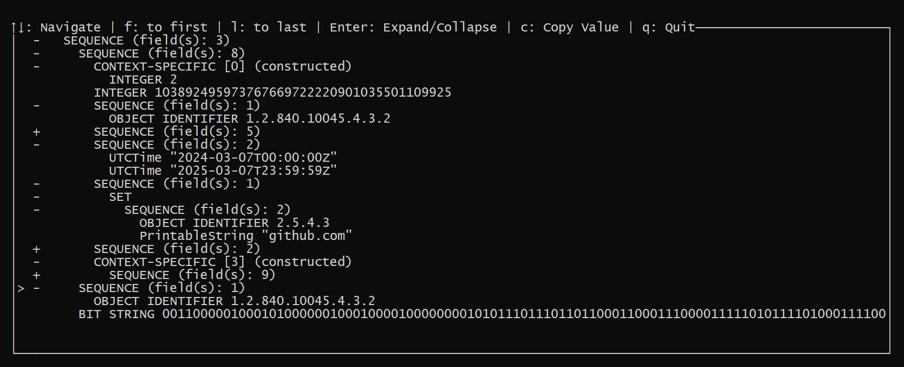
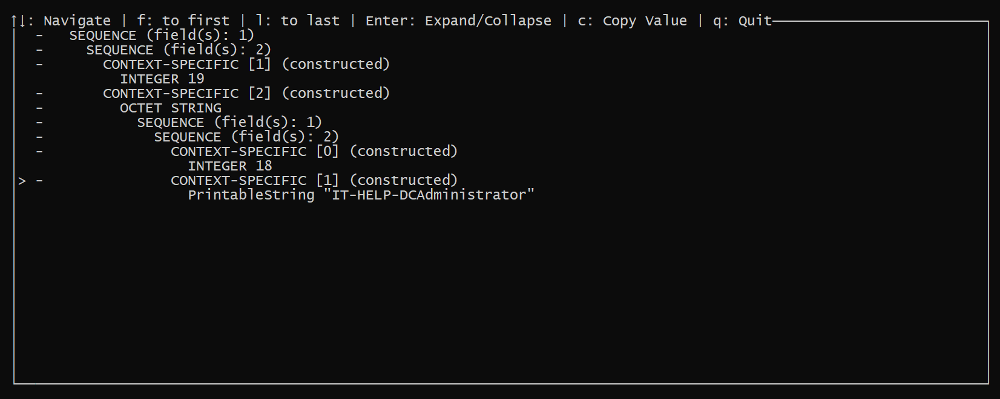

# ASN.1 VIEWER

as1_viewer is a command-line ASN.1 viewer. Use it as a replacement for whatever combination of cat and your editor you currently use for viewing ASN1 format files. 
It is written in Rust and can be installed as a single standalone binary.

# ASN.1

## What is ASN.1?

[ASN1 (Abstract Syntax Notation One)](https://en.wikipedia.org/wiki/ASN.1):

> is a standard interface description language (IDL) for defining data structures that can be serialized and deserialized in a cross-platform way.
>
> It is broadly used in telecommunications and computer networking, and especially in cryptography.

In short: asn1 is a special language for **defining structures**.

### Features

* Visualize asn1 data in terminal. It supports nested structures of any complexity (structure inside the structure, which inside the structure, ...).
* Visualization is interactive:
  * The user can to hide/open structure fields.
  * Ability to copy field data.
* Read input data from `stdin`/file.
* Automatically discard x509 certificates labels.
* Automatically recognize raw bytes, base64, and hex-encoded data.

## License

Licensed under either of:

 * [Apache License, Version 2.0](http://www.apache.org/licenses/LICENSE-2.0)
 * [MIT license](http://opensource.org/licenses/MIT)

at your option.

## Usage

cat examples/test.crt | asn1_viewer

or

asn1_viewer --file examples/test.crt

or ASN.1 in base64

asn1_viewer --asn1 MC8wLaEDAgEToiYEJDAiMCCgAwIBEqEZGxdJVC1IRUxQLURDQWRtaW5pc3RyYXRvcg==

or ASN.1 in hex

asn1_viewer --asn1 302f302da103020113a226042430223020a003020112a1191b1749542d48454c502d444341646d696e6973747261746f72

